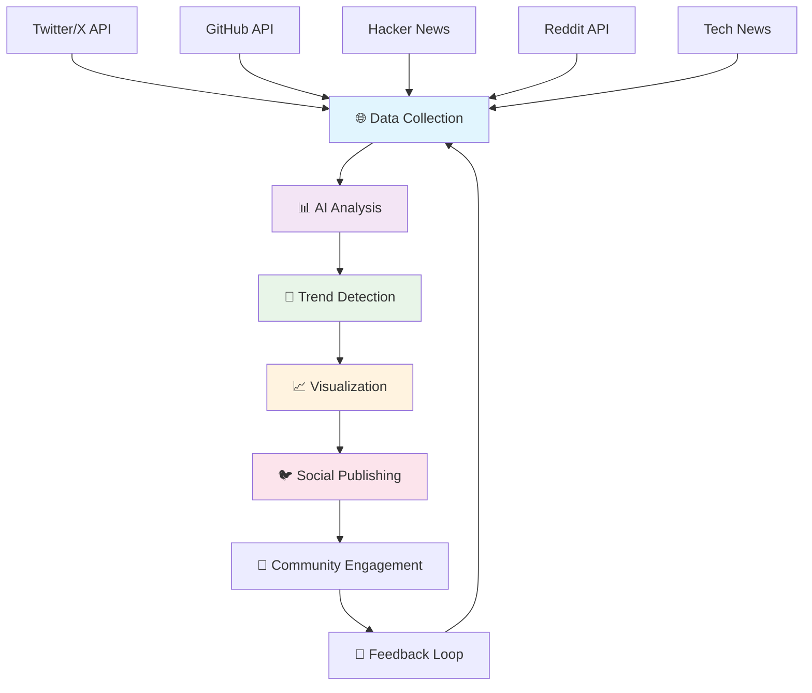
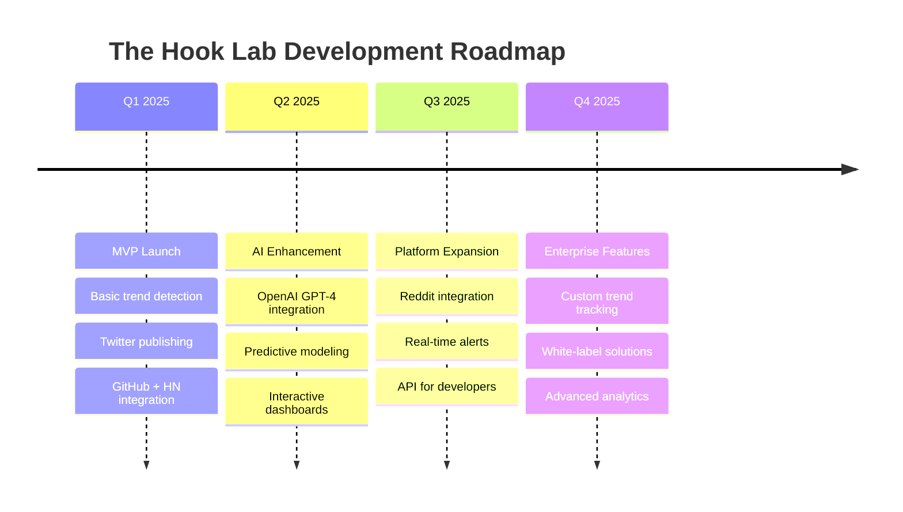

# 🔬 The Hook Lab
### *AI-Powered Tech Trend Analysis & Social Intelligence Platform*

<div align="center">


[](https://python.org)
[](https://openai.com)
[](https://developer.twitter.com)
[](LICENSE)

[](https://github.com/fedorkriuk/the-hook-lab/stargazers)
[](https://github.com/fedorkriuk/the-hook-lab/network)
[](https://github.com/fedorkriuk/the-hook-lab/issues)

</div>

---

## 🚀 What is The Hook Lab?

**The Hook Lab** is an intelligent system that monitors the global tech ecosystem 24/7, analyzing trends across multiple platforms and generating actionable insights that help developers, investors, and tech professionals stay ahead of the curve.

<div align="center">



</div>

## ✨ Features

<table>
<tr>
<td width="50%">

### 🧠 **AI-Powered Analysis**
- OpenAI GPT-4 integration for sentiment analysis
- Predictive trend modeling
- Technology adoption curve analysis
- Competitive landscape mapping

### 📊 **Multi-Source Data Collection**
- Real-time Twitter/X monitoring
- GitHub repository trend tracking
- Hacker News story analysis
- Reddit community sentiment
- Tech news aggregation

</td>
<td width="50%">

### 📈 **Intelligent Insights**
- Weekly trend reports
- Technology spotlight analysis
- Market prediction models
- Developer sentiment tracking

### 🎨 **Beautiful Visualizations**
- Interactive charts and graphs
- Trend timeline visualizations
- Comparative analysis dashboards
- Social media ready graphics

</td>
</tr>
</table>

## 🛠️ Tech Stack

<div align="center">

| **Category** | **Technologies** |
|:---:|:---:|
| **Backend** |    |
| **Database** |   |
| **AI/ML** |    |
| **Visualization** |   |
| **APIs** |   |
| **DevOps** |   |

</div>

## 🏗️ Project Structure

<details>
<summary>📁 Click to expand project structure</summary>

```
the-hook-lab/
├── 📁 src/
│   ├── 🔍 collectors/          # Data collection modules
│   │   ├── twitter_collector.py
│   │   ├── github_collector.py
│   │   ├── hackernews_collector.py
│   │   └── reddit_collector.py
│   ├── 🧠 analyzers/           # AI analysis engines
│   │   ├── sentiment_analyzer.py
│   │   ├── trend_detector.py
│   │   └── prediction_engine.py
│   ├── 📊 visualizers/         # Chart generation
│   │   ├── chart_generator.py
│   │   └── report_builder.py
│   ├── 🐦 publishers/          # Social media publishing
│   │   ├── twitter_publisher.py
│   │   └── content_formatter.py
│   └── 🛠️ utils/              # Utility functions
│       ├── config.py
│       ├── database.py
│       └── helpers.py
├── 📁 tests/                   # Unit tests
├── 📁 docs/                    # Documentation
├── 📁 config/                  # Configuration files
├── 🐳 docker-compose.yml
├── 📋 requirements.txt
└── 📖 README.md
```

</details>

## 🚀 Quick Start

### 1️⃣ **Clone the Repository**

```bash
git clone https://github.com/fedorkriuk/the-hook-lab.git
cd the-hook-lab
```

### 2️⃣ **Set Up Environment**

<details>
<summary>🐍 Using Python Virtual Environment</summary>

```bash
# Create virtual environment
python -m venv venv

# Activate it
# Windows:
venv\Scripts\activate
# macOS/Linux:
source venv/bin/activate

# Install dependencies
pip install -r requirements.txt
```

</details>

<details>
<summary>🐳 Using Docker (Recommended)</summary>

```bash
# Build and run with Docker Compose
docker-compose up --build

# Run in detached mode
docker-compose up -d
```

</details>

### 3️⃣ **Configure API Keys**

```bash
# Copy environment template
cp .env.example .env

# Edit with your API keys
nano .env  # or use your favorite editor
```

<details>
<summary>🔑 Required API Keys</summary>

| **Service** | **How to Get** | **Free Tier** |
|:---:|:---:|:---:|
| Twitter API | [Developer Portal](https://developer.twitter.com) | ✅ 1,500 posts/month |
| OpenAI API | [Platform](https://platform.openai.com) | ❌ Pay per use |
| GitHub API | [Settings](https://github.com/settings/tokens) | ✅ 5,000 requests/hour |
| Reddit API | [App Preferences](https://www.reddit.com/prefs/apps) | ✅ 60 requests/minute |

</details>

### 4️⃣ **Run the Bot**

```bash
# Start the trend analysis engine
python src/main.py

# Or run specific modules
python src/collectors/twitter_collector.py
python src/analyzers/trend_detector.py
```

## 📊 Sample Output

<div align="center">

### Weekly Trend Report Example


*AI-generated insights based on 50K+ developer conversations*

</div>

<details>
<summary>📈 View Sample Tweet Thread</summary>

```
🧵 Tech Trends This Week (Data from 50K+ developer conversations)

1/8 🚀 Next.js App Router mentions up 340% - but sentiment mixed (67% positive)
   📊 GitHub stars: +15% this week
   💬 Main discussion: Performance vs DX trade-offs

2/8 🦀 Rust adoption accelerating in backend services
   📈 Job postings: +25% month-over-month  
   🔥 Hot repos: tokio async updates, axum web framework

3/8 🤖 AI coding tools discussion peaked Tuesday after GitHub Copilot update
   📊 Sentiment: 78% positive
   🔍 Rising: Cursor, Codeium, Tabnine alternatives

[Thread continues with charts and detailed analysis...]
```

</details>

## 🎯 Roadmap

<div align="center">



</div>

## 🤝 Contributing

We love contributions! Here's how you can help make The Hook Lab even better:

<div align="center">

[](https://github.com/fedorkriuk/the-hook-lab/graphs/contributors)

</div>

### 🐛 **Bug Reports & Features**
- Found a bug? [Open an issue](https://github.com/fedorkriuk/the-hook-lab/issues/new?template=bug_report.md)
- Have an idea? [Request a feature](https://github.com/fedorkriuk/the-hook-lab/issues/new?template=feature_request.md)

### 💻 **Code Contributions**
1. Fork the repository
2. Create your feature branch (`git checkout -b feature/AmazingFeature`)
3. Commit your changes (`git commit -m 'Add some AmazingFeature'`)
4. Push to the branch (`git push origin feature/AmazingFeature`)
5. Open a Pull Request

<details>
<summary>📋 Development Guidelines</summary>

- Follow PEP 8 style guide
- Add type hints to all functions
- Write comprehensive tests
- Update documentation
- Ensure all tests pass

```bash
# Run tests
pytest tests/

# Format code
black src/

# Type checking
mypy src/
```

</details>

## 📈 Stats

<div align="center">


</div>

## 📄 License

This project is licensed under the MIT License - see the [LICENSE](LICENSE) file for details.

## 🙏 Acknowledgments

- OpenAI for providing cutting-edge AI capabilities
- Twitter/X for the robust API platform
- GitHub for hosting and API access
- The open-source community for inspiration and tools

---

<div align="center">

### 🌟 Star us on GitHub — it helps!

[](https://star-history.com/#fedorkriuk/the-hook-lab&Date)

**Made with ❤️ by [Fedor Kriuk](https://github.com/fedorkriuk)**

*Turning data into insights, one trend at a time* 🚀

</div>

---

<details>
<summary>📧 Contact & Support</summary>

- 📧 Email: [your-email@domain.com](mailto:your-email@domain.com)
- 🐦 Twitter: [@your-handle](https://twitter.com/your-handle)
- 💼 LinkedIn: [Your LinkedIn](https://linkedin.com/in/your-profile)
- 🌐 Website: [your-website.com](https://your-website.com)

</details>
