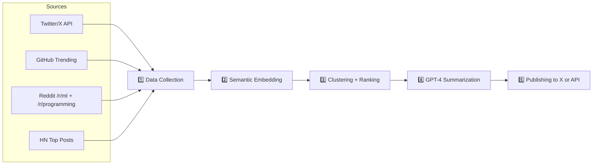

# 🚀 The Hook Lab – Tech Trend Bot


---

## 📡 What is Tech Trend Bot?

**Tech Trend Bot** is an open-source AI-powered bot that continuously scans developer conversations, GitHub repos, Twitter/X chatter, and Reddit threads to detect **emerging trends in tech**.

It uses LLMs, vector search, and social graph analysis to extract **signal from noise**, summarize hot topics, and publish tweet threads, dashboards, or reports for devs, VCs, and curious technologists.

### 🧠 Built with:
- OpenAI + LangChain for summarization and reasoning
- Twitter API, GitHub API, Reddit API for data
- Pinecone / FAISS for semantic similarity
- Plotly for visualizations
- FastAPI backend + Celery tasks

---

## ⚙️ How It Works



### 📊 Output Examples:
- 📈 Weekly Tech Trend Reports
- 🧵 Daily X/Twitter Threads like:
  > "🧵 Top AI tools exploding this week (data from 15,000 dev conversations)"
- 🌐 API for other bots/newsletters to query latest trends

---

## ✨ Features

- 🛰️ Real-time trend detection
- 🔎 Topic clustering with vector search
- 💬 LLM-generated insights (GPT-4)
- 📉 Hype decay & velocity analysis
- 📡 Social signal noise filtering
- 📤 Auto-publishing with retry queues

---

## 🛠 Tech Stack

| Layer       | Tools Used                                  |
|-------------|----------------------------------------------|
| Data        | Twitter API, GitHub API, Reddit API, HN API |
| Embeddings  | OpenAI, HuggingFace Transformers             |
| Backend     | FastAPI, Celery, PostgreSQL, Redis           |
| ML Layer    | FAISS / Pinecone, Scikit-learn, GPT-4        |
| Visualization | Plotly, Matplotlib                         |
| Deployments | Docker, GitHub Actions, Render / Fly.io      |

---

## 📦 Project Structure

```bash
tech-trend-bot/
├── src/
│   ├── collectors/        # Data ingestion from APIs
│   ├── embeddings/        # Vector generation and indexing
│   ├── trend_ranker/      # Cluster + hype scoring logic
│   ├── summarizer/        # GPT-4/LangChain summarization
│   ├── publisher/         # Tweet threads, API posts
│   ├── api/               # FastAPI routes
│   └── utils/             # Helpers, config loaders
├── tasks/                 # Scheduled Celery jobs
├── .env.example           # Env config template
├── docker-compose.yml     # Containerized app
└── README.md
```

---

## 🌍 Live Demo

> Coming soon: [hooklab.ai/trends](https://hooklab.ai/trends) (under development)

Follow [@fedorkriuk](https://x.com/fedorkriuk) for progress + beta invites 🚀

---

## 🤝 Contributing

We welcome all PRs and discussions! Here’s how to get started:

```bash
# 1. Clone repo
$ git clone https://github.com/fedorkriuk/the-hook-lab.git

# 2. Setup environment
$ cp .env.example .env
$ pip install -r requirements.txt

# 3. Run collector
$ python src/collectors/twitter_collector.py

# 4. Start backend
$ uvicorn src.api.main:app --reload
```

### 🛠 Contributor Ideas:
- Add more data sources (e.g. Stack Overflow, LinkedIn)
- Improve trend velocity detection logic
- Add UI dashboard for browsing clusters
- Build Notion/Slack/Zapier integrations

---

## 📜 License

MIT — use it, remix it, build your own trend bots.

---

<div align="center">
  
</div>

[](https://github.com/fedorkriuk)
[](https://twitter.com/fedorkriuk)
[](https://linkedin.com/in/fedorkriuk)

</div>
